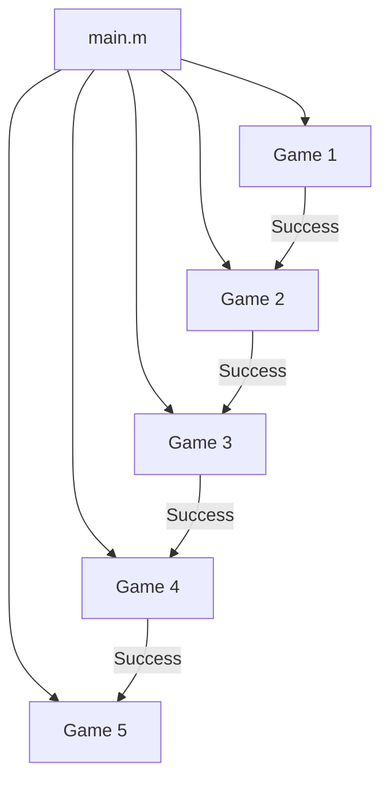

# 🎮 MATLAB Mini Games Suite

A multi-stage interactive game suite developed in **MATLAB**, designed to challenge players with a series of logic, memory, and word-based games. Each game must be completed successfully to unlock the next, creating a progressive and engaging gameplay experience.

---

## 📌 Overview

This project is a collection of educational and entertaining games built in MATLAB. It's ideal for learning flow control, modular programming, and interactive console input/output through a fun, game-based format. Perfect for students, educators, or anyone looking to explore MATLAB programming in an interactive way.

> ✅ **Educational Value**: Each game reinforces key MATLAB programming concepts.  
> ✅ **Progressive Difficulty**: Players must pass each level to unlock the next.  
> ✅ **Fully Text-Based**: No external libraries or toolboxes required.

---

## 🧩 Included Games

1. **Guess What** — A number or pattern guessing challenge to test your intuition.  
2. **Memory Match** — Sharpen your focus by matching items using memory.  
3. **Rock Paper Scissors** — Compete in the classic logic-based game of strategy.  
4. **Hangman** — Guess words letter by letter in this deduction-based challenge.  
5. **Connect Four** — Align four tokens in a strategic grid-based game.

> 🎯 **Replayability**: Players can retry failed stages without starting over.  
> 🧠 **Skill Focus**: Logical reasoning, memory retention, pattern recognition, and vocabulary.

---

## 📂 File Structure

```plaintext
Mini_Games/
│
├── main.m                # Main controller that manages game flow
├── guesswhat.m           # Game 1: Guess What
├── memoryMatch.m         # Game 2: Memory Match
├── Rookpaperscissors.m   # Game 3: Rock Paper Scissors
├── Hangman.m             # Game 4: Hangman
└── connectFour.m         # Game 5: Connect Four
```

> 🛠️ **Modular Design**: Each game is isolated in its own script for clarity and reusability.  
> 📁 **Scalable**: New games can be added with minimal changes to `main.m`.

---

## 🧩 Code Architecture



> 🔄 **Sequential Unlocking**: Players must complete one stage to move on to the next.

---

## 💡 Game Flow

The player starts with **Guess What**, and must pass each game to advance. If the player fails a game, they will retry that game without restarting the entire suite. Once all five games are completed, the program ends with a final message.

> 🧭 **Failure Recovery**: Designed to encourage learning by allowing retries on failure.  
> 🏁 **End Condition**: Final congratulatory message after all games are successfully completed.

---

## 🚀 How to Run

1. **Download the Project**: Clone or download the repository to your local machine.  
2. **Set Up MATLAB**: Open MATLAB (R2020 or later) and navigate to the project folder containing all `.m` files.  
3. **Execute the Main Script**: Run the following command in the MATLAB Command Window:

```matlab
main
```

> ⚠️ **Note**: Ensure all files are in the same directory to avoid execution errors.

---

## 🙌 Contributions

Contributions, ideas, or enhancements are welcome. Feel free to fork the repo or submit a pull request.

> 💬 **Suggestions**: Bug fixes, new games, difficulty levels, or graphical enhancements are appreciated.

---
