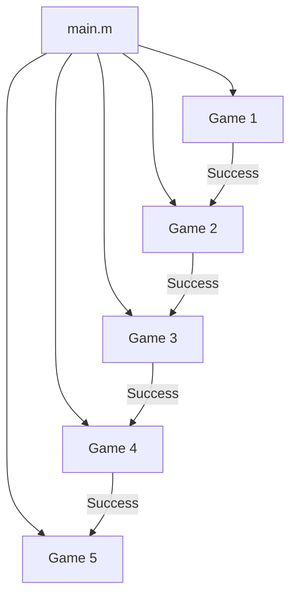

````markdown
# 🎮 MATLAB Mini Games Suite

A multi-stage interactive game suite developed in **MATLAB**, designed to challenge players with a series of logic, memory, and word-based games. Each game must be successfully completed to proceed to the next, creating a progressive gameplay experience.

---

## 📌 Overview

This project serves as a small collection of educational and fun games built in MATLAB. It’s perfect for learning flow control, modular programming, and interactive console input/output in a structured, game-based format.

---

## 🧩 Included Games

1. **Guess What** — A number or pattern guessing challenge.
2. **Memory Match** — Match items using memory and focus.
3. **Rock Paper Scissors** — The classic logic-based game.
4. **Hangman** — A word guessing game based on deduction.
5. **Connect Four** — A strategic grid-based alignment game.

---

## 🛠 Requirements

- MATLAB R2020 or later
- No external toolboxes required
- All `.m` files must be in the same folder

---

## 🚀 How to Run

1. Clone or download this repository.
2. Open the folder in **MATLAB**.
3. Run the main file:

```matlab
main
````

---

## 📂 File Structure

```plaintext
Mini_Games/
│
├── main.m                # Main controller that manages game flow
├── guesswhat.m           # Game 1: Guess What
├── memoryMatch.m         # Game 2: Memory Match
├── Rookpaperscissors.m   # Game 3: Rock Paper Scissors
├── Hangman.m             # Game 4: Hangman
└── connectFour.m         # Game 5: Connect Four
```

---

## 🧩 Code Architecture

## 💡 Game Flow

The player starts with **Guess What**, and must pass each game to advance. If the player fails a game, they will retry that game without restarting the entire suite. Once all five games are completed, the program ends with a final message.

---

---

## 🙌 Contributions

Contributions, ideas, or enhancements are welcome. Feel free to fork the repo or submit a pull request.

---
```
```
